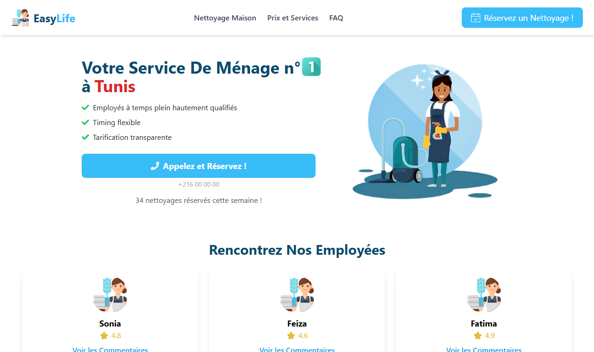
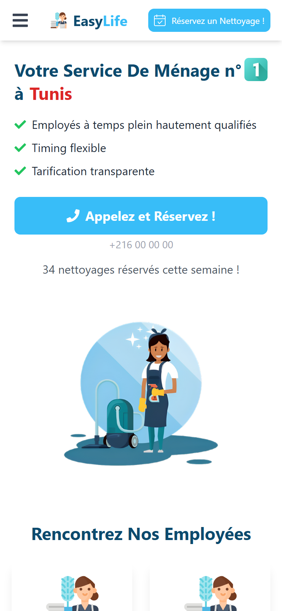

# EasyLife — Cleaning Service Landing Page

A responsive landing page prototype for **EasyLife**, a home cleaning service in Tunis, built with **React**, **Tailwind CSS** and **Framer Motion**. The site content is in French, for its local audience.

**Live demo:** https://easylife-ten.vercel.app

> **Status: work in progress (discontinued).** This was a prototype built for a client. Development stopped after the first sections because the client had not settled on the rest of the content, and the project was then cancelled. The *Prix et Services* and *FAQ* sections are placeholders, the review buttons are not wired up, and the phone number is a dummy.

<p align="center">
  
  &nbsp;
  
</p>

## What is built

- **Responsive layout**: desktop navigation bar, collapsible animated menu on mobile
- **Hero section** with the service's selling points and click-to-call booking buttons (`tel:` links)
- **"Meet our team" cards** that animate into view as you scroll (Framer Motion `whileInView`)
- **Smooth scrolling** navigation between sections
- Deployed on **Vercel**

## Planned but not built

- Pricing and services section
- FAQ
- Customer reviews for each team member
- Real booking flow and contact details

## Tech stack

| | |
|---|---|
| UI | React 19 (Create React App) |
| Styling | Tailwind CSS 3 |
| Animation | Framer Motion |
| Icons | react-icons (Font Awesome) |
| Tests | Jest + React Testing Library |
| Hosting | Vercel |

## Getting started

Requires **Node.js 18+**.

```bash
git clone https://github.com/aziz-hizem/easylife.git
cd easylife
npm install
npm start
```

The app runs at http://localhost:3000.

| Command | Description |
|---|---|
| `npm start` | Development server with hot reload |
| `npm test` | Run the tests in watch mode |
| `npm run build` | Production build in `build/` |

## Project structure

```
easylife/
├── public/          # HTML template, favicon, web manifest
├── src/
│   ├── App.js       # The whole landing page
│   ├── App.test.js  # Rendering tests
│   ├── assets/      # Illustrations and icons
│   └── index.js     # Entry point
├── docs/            # README screenshots
└── tailwind.config.js
```
